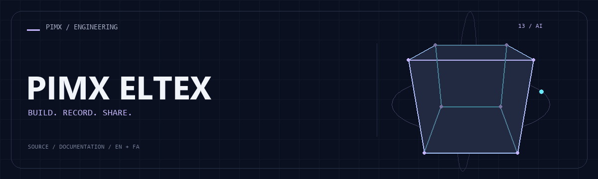

<div align="center">



**[English](README.md) · [فارسی](README.fa.md)**

</div>

# 🎬 PIMX ELTEX

A Next.js publishing platform for AI-building episodes, code resources and project previews, with member accounts, comments and an administrative console.

[GitHub](https://github.com/MOHAMMADREZAABEDINPOOR/PIMX_ELTEX) · [PIMX / Profile](https://github.com/MOHAMMADREZAABEDINPOOR) · [Static artwork](assets/readme/hero.png)

| At a glance | Details |
|:---|:---|
| 🎬 Experience | Web application / browser experience |
| 🧰 Built with | `React` · `Next.js` · `TypeScript` · `Framer Motion` |
| 🌐 Documentation | [English](README.md) · [فارسی](README.fa.md) |

[✨ Features](#features) · [🚀 Getting started](#getting-started) · [⚙️ Configuration](#configuration) · [🌍 Deployment](#deployment)

📖 [Detailed project guide](docs/PROJECT_GUIDE.md)

---

<a id="features"></a>

## ✨ Features

| Area | Included capability |
|:---|:---|
| ⚡ Workflow | Episode pages, code library and bundled project content |
| 👤 Accounts | Member authentication, profile and session controls |
| 👤 Accounts | Comments, reactions and content administration |
| 🔌 Integration | Drizzle/D1 migrations, email helpers and Cloudflare deployment |

<a id="stack"></a>

## 🧰 Stack

| Tool | Version / source |
|---|---|
| React | `19.2.8` |
| Next.js | `16.3.5` |
| TypeScript | `^5` |
| Framer Motion | `^13.2.0` |
| Tailwind CSS | `^4` |

<a id="getting-started"></a>

## 🚀 Getting started

Node.js 22.12+ and the package manager declared in package.json. Install dependencies from the checked-in lockfile where available.

```bash
git clone https://github.com/MOHAMMADREZAABEDINPOOR/PIMX_ELTEX.git
cd PIMX_ELTEX

npm ci
npm run dev
```

<a id="configuration"></a>

## ⚙️ Configuration

These names are found in the example configuration or source; not all are required. Check their defaults/usage in those files and supply secrets only in your local or hosting environment.

| Name | Role |
|---|---|
| `AUTH_SECRET` | Credential/connection setting; keep private |
| `NEXT_DIST_DIR` | Application setting; inspect its definition |
| `NEXT_PUBLIC_CF_ANALYTICS_TOKEN` | Public browser configuration; never put secrets here |
| `NEXT_PUBLIC_CONTACT_EMAIL` | Public browser configuration; never put secrets here |
| `NEXT_PUBLIC_PRIVACY_EMAIL` | Public browser configuration; never put secrets here |
| `NEXT_PUBLIC_SITE_URL` | Public browser configuration; never put secrets here |
| `NEXT_PUBLIC_TURNSTILE_SITE_KEY` | Public browser configuration; never put secrets here |
| `NEXT_PUBLIC_YOUTUBE_URL` | Public browser configuration; never put secrets here |
| `PIMX_STATIC_BUILD` | Application setting; inspect its definition |
| `SMTP_APP_PASSWORD` | Credential/connection setting; keep private |
| `SMTP_USER` | Application setting; inspect its definition |
| `TURNSTILE_SECRET_KEY` | Credential/connection setting; keep private |

Hosting bindings: `ASSETS`, `BACKEND`, `DB`.

<a id="usage"></a>

## 🎯 Usage

Set public configuration from `.env.example` and Worker secrets from `.dev.vars.example`. Prepare the local D1 database using `npm run db:setup:local`; use the Cloudflare preview for bindings-backed workflows.

<a id="project-structure"></a>

## 🗂️ Project structure

| Path | Role |
|---|---|
| [`assets/`](assets/) | Brand/media/README assets |
| [`docs/`](docs/) | Supporting documentation |
| [`drizzle/`](drizzle/) | Database migrations |
| [`public/`](public/) | Public web assets |
| [`scripts/`](scripts/) | Development and maintenance utilities |
| [`src/`](src/) | Application source |
| [`package.json`](package.json) | Project entry/configuration file |
| [`tsconfig.json`](tsconfig.json) | Project entry/configuration file |
| [`wrangler.toml`](wrangler.toml) | Project entry/configuration file |
| [`wrangler.worker.toml`](wrangler.worker.toml) | Project entry/configuration file |

<a id="commands-and-checks"></a>

## 🧪 Commands and checks

| Command | Purpose |
|:---|:---|
| `npm run dev` | 🧑‍💻 Development server |
| `npm run build` | 📦 Production build |
| `npm run start` | ▶️ Application server |
| `npm run lint` | 🧹 Lint source |
| `npm run typecheck` | 🔧 typecheck |
| `npm run preview` | 👀 Preview a build |
| `npm run pages:build` | 🔧 pages:build |

```bash
npm run dev
npm run build
npm run start
npm run lint
npm run typecheck
npm run security:secrets
npm run preview
npm run pages:build
npm run db:setup:local
```

These commands are declared in package.json; the list is not a test execution report. Test commands may need a browser, service or prepared database.

<a id="deployment"></a>

## 🌍 Deployment

Use build/start for Node hosting, or the Cloudflare-specific package.json scripts with your own bindings. Configure databases/secrets separately and consult the repository’s supporting guides.

<a id="limitations"></a>

## 📌 Limitations

Next.js development mode does not reproduce all Cloudflare bindings. Email and authentication need environment-specific secrets. Content-publishing and remote-migration scripts write to external resources; configure them deliberately.

<a id="troubleshooting"></a>

## 🛠️ Troubleshooting

- Missing packages: install dependencies using the project’s package manager.
- API/network failure: check the configured origin, provider and hosting bindings.
- Old assets: rebuild when a build script exists, then clear the browser cache.

<a id="contributing"></a>

## 🤝 Contributing

Create a focused branch, verify the affected behavior and explain the change clearly. Keep private data, build outputs and local databases out of commits.

<a id="license"></a>

## 📄 License

No repository-level license file is included in this snapshot. Public visibility alone does not grant reuse rights; contact the repository owner for terms.

---

Part of **PIMX** · Documentation in English and Persian.

---

<div align="center">

🎬 **PIMX ELTEX** · [English](README.md) · [فارسی](README.fa.md)

</div>
